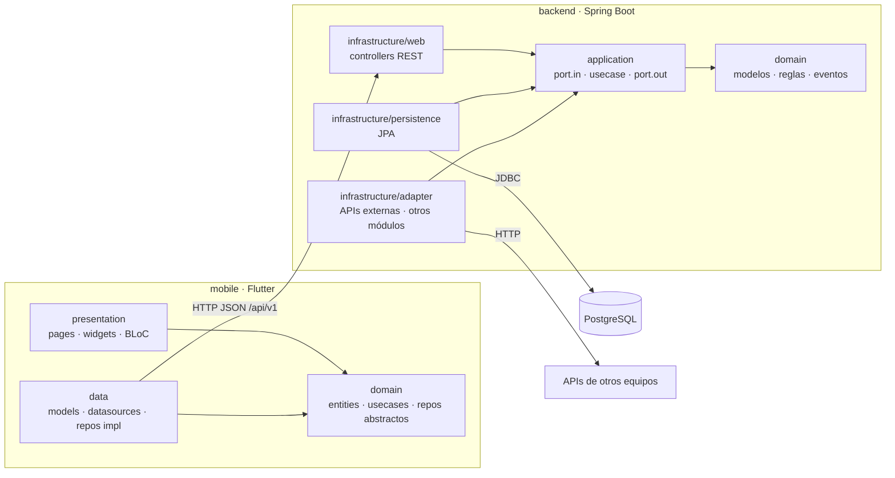

# Arquitectura

Backend y móvil siguen **Clean Architecture** con la misma regla: *las dependencias apuntan hacia el dominio*.
El dominio no conoce frameworks, base de datos ni HTTP; eso permite que otros equipos integren sus módulos
cambiando solo adaptadores.



## Backend (`backend/`)

Paquete raíz `com.selahfinance`, organizado **por módulo** (bounded context) y dentro **por capa**:

```
com.selahfinance
├── config/                 Raíz de composición: SecurityConfig, ClockConfig, SchedulingConfig, AdminBootstrap, DemoDataSeeder (perfil demo)
├── shared/                 Kernel: Dinero, Periodo, CalendarioSabado, DimensionMayordomia, DomainEvent, errores (RFC 9457), UsuarioActual
├── identidad/              Registro, login JWT, roles, gestión de cuentas (admin), perfil y consentimiento
├── iglesias/               Catálogo de iglesias (público para registrarse; CRUD solo admin)
├── hogar/                  Hogar y configuración de mayordomía (diezmo %, ofrenda, Modo Sábado)
├── movimientos/            Fuente única de captura de dinero
├── mayordomia/             Apartado de diezmo/ofrenda, entregas, historial
├── categorias/ metas/      Presupuesto por categoría · fuentes de ingreso · metas de ahorro
├── deudas/                 Cuota (sistema francés), pagos con capital/interés, límite de endeudamiento
├── habitos/                Catálogo 4T y registros diarios; alimenta el reporte
├── reportes/               Semáforo, presupuesto vs real, reporte 4T (snapshot mensual + job programado)
├── reflexion/              Reflexión semanal (viernes ≥15:00 y sábado)
├── notificaciones/         Bandeja en la app, preferencias, Modo Sábado (posponer avisos de consumo)
├── congregacion/           Vista del PASTOR: totales anónimos + reportes compartidos por consentimiento
├── inicio/                 Agregado de solo lectura para la pantalla Inicio
└── integraciones/          API keys, webhooks firmados (outbox), consumo de APIs externas
```

Cada módulo:

| Capa | Contiene | Puede depender de |
|---|---|---|
| `domain/` | Entidades, value objects, servicios de dominio, eventos. **Java puro.** | `shared.domain` |
| `application/port/in` | Interfaces de casos de uso (API pública del módulo) | domain |
| `application/port/out` | Lo que el caso de uso necesita (repositorios, APIs) | domain |
| `application/usecase` | Implementación (`@Service`, `@Transactional`) | ports, domain |
| `infrastructure/persistence` | `@Entity`, Spring Data, mapeo entidad ↔ dominio | application, domain |
| `infrastructure/web` | Controladores REST y DTOs | application.port.in |
| `infrastructure/adapter` | Implementa `port.out` usando otro módulo o una API externa | application |

**Reglas verificadas en cada `mvn test`** (`ArquitecturaTest`, ArchUnit):
1. `domain` no importa Spring, JPA, Jackson ni Lombok.
2. `application` no importa `infrastructure` ni web/data de Spring.
3. Sin ciclos entre módulos.
4. De otro módulo solo se usa su `application.port.in` y su `domain` (nunca su `usecase` ni su `persistence`).

**Comunicación entre módulos:**
- *Síncrona*: un adaptador (`infrastructure/adapter`) implementa el `port.out` propio llamando al `port.in` del otro módulo.
  Ej.: `mayordomia.PoliticaMayordomiaAdapter` → `hogar.ConfiguracionMayordomiaUseCase`. Si mañana `hogar` es un
  microservicio de otro equipo, solo se reescribe el adaptador como cliente HTTP.
- *Por eventos*: `movimientos` publica `MovimientoRegistrado`; `mayordomia` lo escucha y genera los apartados en la
  **misma transacción**. El mismo evento se guarda en `evento_outbox` para notificar a sistemas externos.

**Convenciones:** dinero con `Dinero` (BigDecimal, 2 decimales, HALF_EVEN); fechas de negocio con `Clock` inyectado;
errores como `application/problem+json` (RFC 9457): 422 regla de negocio, 404 no encontrado, 400 validación, 401/403 acceso.
El `Clock` usa la zona `America/Lima` (`selah.zona-horaria`): "hoy", el mes y el sábado son los del usuario, no los de UTC.
Con los perfiles `dev`/`demo` se puede simular la hora (`SELAH_DEMO_RELOJ_SIMULADO`) para mostrar el Modo Sábado.

### Roles y permisos

| Rol | Alcance | Rutas |
|---|---|---|
| `ADMIN` | Gestiona cuentas, iglesias e integraciones. **No tiene hogar ni ve finanzas de nadie.** | `/api/v1/admin/**` |
| `PASTOR` | Persona con finanzas propias **y** vista de su congregación (totales anónimos + reportes compartidos). | `/api/v1/pastor/**` + las de hermano |
| `HERMANO` | Usuario normal: sus finanzas, hábitos y reportes. Decide si comparte su reporte con su pastor. | todo lo demás |

- El rol viaja en el claim `rol` del JWT, pero `SesionVigenteFilter` **revalida estado y rol contra la BD en cada petición**: bloquear una cuenta o cambiarle el rol surte efecto de inmediato (no hay que esperar a que venza el token).
- Las rutas se protegen en `SecurityConfig`; además cada caso de uso valida su regla (defensa en profundidad).
- **Privacidad por diseño:** el pastor nunca recibe montos; los promedios de congregación exigen un mínimo de personas (`selah.congregacion.minimo-anonimato`, 3 por defecto) para que nadie sea identificable; lo individual solo se ve con consentimiento explícito (`usuario.comparte_reporte_desde`). Ver [reporte-4T.md](reporte-4T.md).

### Cómo agregar un módulo (ej. `metas`)
1. `domain/model/MetaAhorro.java` con sus reglas + test unitario.
2. `application/port/in/*UseCase.java` y `port/out/MetaRepositoryPort.java`.
3. `application/usecase/*Service.java`.
4. `infrastructure/persistence/*JpaEntity`, `*JpaRepository`, `*PersistenceAdapter` (la tabla ya existe en la migración).
5. `infrastructure/web/*Controller` bajo `/api/v1/metas`.
6. Si cambia el esquema: **nueva** migración `V10__...sql` (nunca editar una ya aplicada; hoy la última es V9).

## Móvil (`mobile/`)

```
lib/
├── main.dart · app.dart
├── core/
│   ├── bloc/          AsyncCubit/AsyncState · AccionCubit · datos_cambiados (refresco entre pestañas) · transformers
│   ├── config/        AppConfig (URLs por --dart-define)
│   ├── di/            injection_container.dart (get_it)
│   ├── domain/        Dimension (4T) · Semaforo · RolUsuario
│   ├── error/         Failure (sealed) · Result<T> (Exito/Fallo)
│   ├── network/       ApiClient (Dio) · AuthInterceptor · api_error_mapper · safe_call · ExternalApiRegistry
│   ├── router/        go_router: rutas · redirección por rol (función pura y probada) · shells con pestañas
│   ├── storage/       TokenStorage (flutter_secure_storage)
│   ├── theme/         AppColors (paleta del prototipo) · AppTheme (Epilogue)
│   ├── usecase/       UseCase<T, P>
│   ├── utils/         Formato (moneda S/, fechas es) · json_utils · entrada
│   └── widgets/       AsyncView, componentes compartidos, RecargarAlCambiar, SecretoDialog
└── features/<feature>/
    ├── data/          models (JSON) · repositories (impl)
    ├── domain/        entities · repositories (abstractos) · usecases
    └── presentation/  bloc/cubit · pages · widgets
```

Features: `auth`, `onboarding`, `iglesias`, `movimientos`, `mayordomia` (diezmos), `dashboard` (Inicio), `categorias`,
`metas` (+ deudas), `reportes` (finanzas y 4T), `habitos`, `reflexion`, `notificaciones`, `configuracion` (perfil y asistente),
`pastor` y `admin` (resumen, usuarios, iglesias, integraciones).

**Navegación por rol** (`core/router/redireccion.dart`): sin sesión → login; contraseña temporal → cambio obligatorio;
hermano/pastor sin asistente → asistente de 4 pasos; el **admin nunca ve pantallas de finanzas** (lo redirige a su panel).
Cada rol tiene su propio shell de pestañas: hermano/pastor (Inicio · Movimientos · Diezmos · Metas · Reportes) y admin
(Resumen · Usuarios · Iglesias · Integraciones).

**Patrón BLoC:**
- `movimientos` y `auth` usan `Bloc` con eventos y estados `sealed` (switch exhaustivo).
- Las pantallas de consulta/edición simple usan `Cubit` (`AsyncCubit<T>`: inicial → cargando → éxito | fallo, conserva los datos al recargar)
  y los formularios de un solo disparo `AccionCubit`. Sigue siendo `flutter_bloc`: la UI solo llama métodos y pinta estados.
- Tras una modificación (`mutar`), el cubit se recarga y avisa por `datosCambiados`; Inicio, Diezmos, Metas y Reportes se refrescan
  solos, de modo que **ninguna pestaña muestra cifras viejas**.

**Regla de datos pragmática:** `movimientos` y `auth` mantienen la separación completa datasource → repository (referencia para
features complejas). Las features simples (metas, hábitos, admin, pastor, reportes…) tienen el repositorio implementado directamente
sobre `Dio` con `intentar()` → `Result<T>`: mismo contrato hacia el dominio, sin una capa de datasource que solo reenvíe llamadas.
El dominio y la presentación **no** conocen Dio.

**Pruebas** (`flutter test`): reglas de redirección por rol; modelos y sesión; BLoC de movimientos; y **contrato app ↔ backend**
(`test/contrato/`), que parsea con los repositorios reales 24 respuestas JSON capturadas del backend (`test/fixtures/`).
Si el backend cambia un campo, fallan estas pruebas y no la presentación.

**Feature de referencia para copiar:** `features/movimientos/` (incluye tests en `test/features/movimientos/`).
