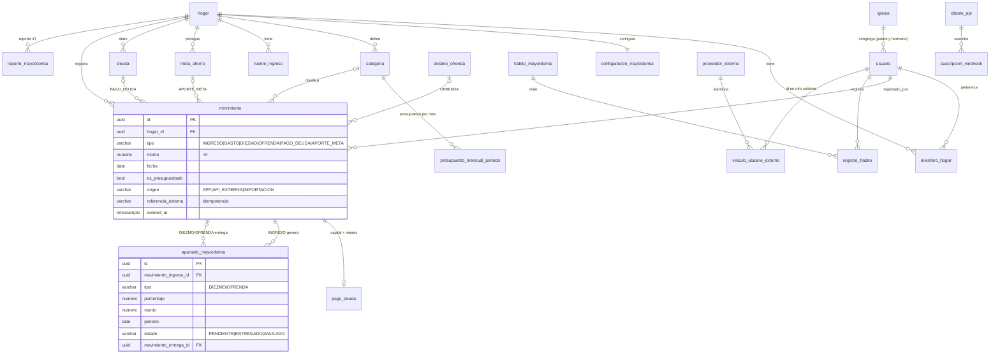
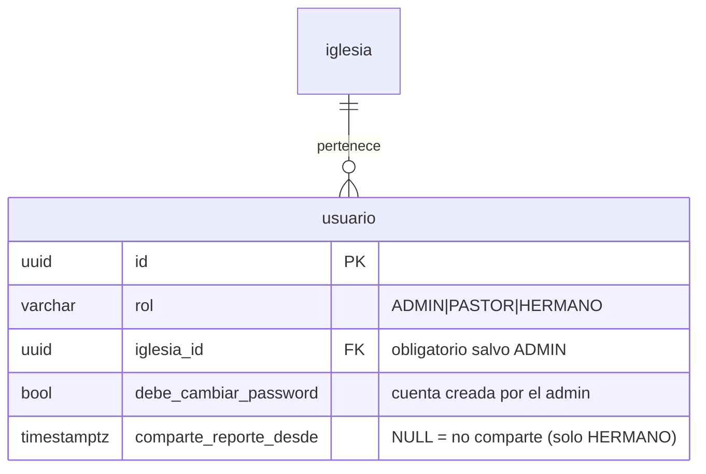

# Base de datos (PostgreSQL 14+)

- **Fuente de verdad del esquema:** migraciones Flyway en
  [`backend/src/main/resources/db/migration`](../backend/src/main/resources/db/migration). Hibernate solo *valida* (`ddl-auto: validate`).
- Convenciones: PK `UUID`, `TIMESTAMPTZ`, dinero `NUMERIC(14,2)`, enumeraciones como `VARCHAR + CHECK`,
  `updated_at` por trigger, borrado lógico (`deleted_at`) en datos financieros.
- Las reglas de negocio viven en el dominio del backend; la BD garantiza integridad (FK, CHECK, UNIQUE).

| Migración | Contenido |
|---|---|
| V1 | usuario, refresh_token, hogar, miembro_hogar, configuracion_mayordomia, preferencia_notificacion |
| V2 | fuente_ingreso, categoria, presupuesto_mensual_periodo, meta_ahorro, deuda, destino_ofrenda |
| V3 | **movimiento** (fuente única), **apartado_mayordomia** (diezmo/ofrenda) |
| V4 | cliente_api, proveedor_externo, vinculo_usuario_externo, evento_outbox, suscripcion_webhook, auditoria |
| V5 | habito_mayordomia, registro_habito, reporte_mayordomia (4T), pregunta_reflexion, reflexion_semanal, notificacion |
| V6 | Vistas: v_resumen_mensual, v_presupuesto_vs_real, v_meta_progreso |
| V7 | Semillas: 18 hábitos 4T, 5 destinos de ofrenda, 10 preguntas de reflexión |
| V8 | **Roles e iglesias:** tabla `iglesia`; `usuario.rol` ∈ ADMIN/PASTOR/HERMANO, `iglesia_id`, `debe_cambiar_password`, `comparte_reporte_desde` |
| V9 | `pago_deuda` (capital vs. interés por pago, reversible) y `notificacion.clave_dedupe` (un recordatorio por usuario y periodo) |

## Diagrama entidad-relación (núcleo)



## Roles, iglesias y consentimiento (V8)



- **ADMIN** no tiene iglesia ni hogar: `CHECK (rol='ADMIN' OR iglesia_id IS NOT NULL)`. No existe ninguna consulta suya sobre
  tablas financieras.
- **Consentimiento:** `comparte_reporte_desde` (con fecha = queda evidencia de cuándo aceptó); `CHECK` impide que lo use un no-hermano.
  El pastor solo ve hermanos **activos, de su iglesia y con consentimiento**.
- **Anonimato:** los totales de congregación se calculan solo si hay al menos `selah.congregacion.minimo-anonimato` (3) hermanos
  con datos; si no, el backend no devuelve promedios.
- Los hermanos se registran solos y eligen iglesia (`GET /api/v1/iglesias`, público); pastores y admins los crea un admin
  con contraseña temporal (se muestra una sola vez y debe cambiarse al primer ingreso).

## Reglas clave reflejadas en el modelo

**Única fuente de verdad.** Todo flujo de dinero es una fila de `movimiento`. `meta_ahorro` no guarda
`monto_actual`: se deriva de los `APORTE_META` (`v_meta_progreso`). CHECKs obligan: gasto → categoría,
pago → deuda, aporte → meta.

**Primicias (diezmo antes del saldo).** Al registrar un `INGRESO`, el dominio crea en la misma transacción un
`apartado_mayordomia` de DIEZMO (y OFRENDA si aplica) en estado `PENDIENTE`. "Marcar como entregado" crea un
movimiento `DIEZMO` y enlaza los apartados. Si se elimina el ingreso, los apartados pendientes pasan a `ANULADO`
(lo ya entregado se conserva).

```
saldo_disponible = ingresos
                 − apartados PENDIENTES
                 − movimientos DIEZMO/OFRENDA (lo entregado)
                 − gastos − pagos de deuda − aportes a metas
```

Así el diezmo se descuenta desde que se aparta, y no se descuenta dos veces al entregarlo
(verificado: ingreso 4500, 10% + 2% → saldo 3960 antes y después de entregar).

**Deudas.** `cuota_mensual` la calcula el dominio (sistema francés, `CalculadoraDeuda`); `version` para bloqueo optimista. Cada `PAGO_DEUDA` se descompone en **interés primero, luego capital** (`pago_deuda`); si se elimina el movimiento, el saldo de la deuda se revierte.

**Integraciones.** `movimiento(hogar_id, origen, referencia_externa)` es UNIQUE: un sistema externo puede reintentar
sin duplicar. Las API keys se guardan como SHA-256 (se muestran una sola vez al crearlas); los secretos de webhook se guardan **cifrados** con AES-GCM (`SELAH_CLAVE_CIFRADO`); los secretos de proveedores externos van en variables de entorno.

**Notificaciones.** `notificacion.programada_para` permite posponer avisos de consumo durante el Modo Sábado (viernes 18:00 → sábado 18:00, hora de Lima); `clave_dedupe` evita repetir el mismo recordatorio.
